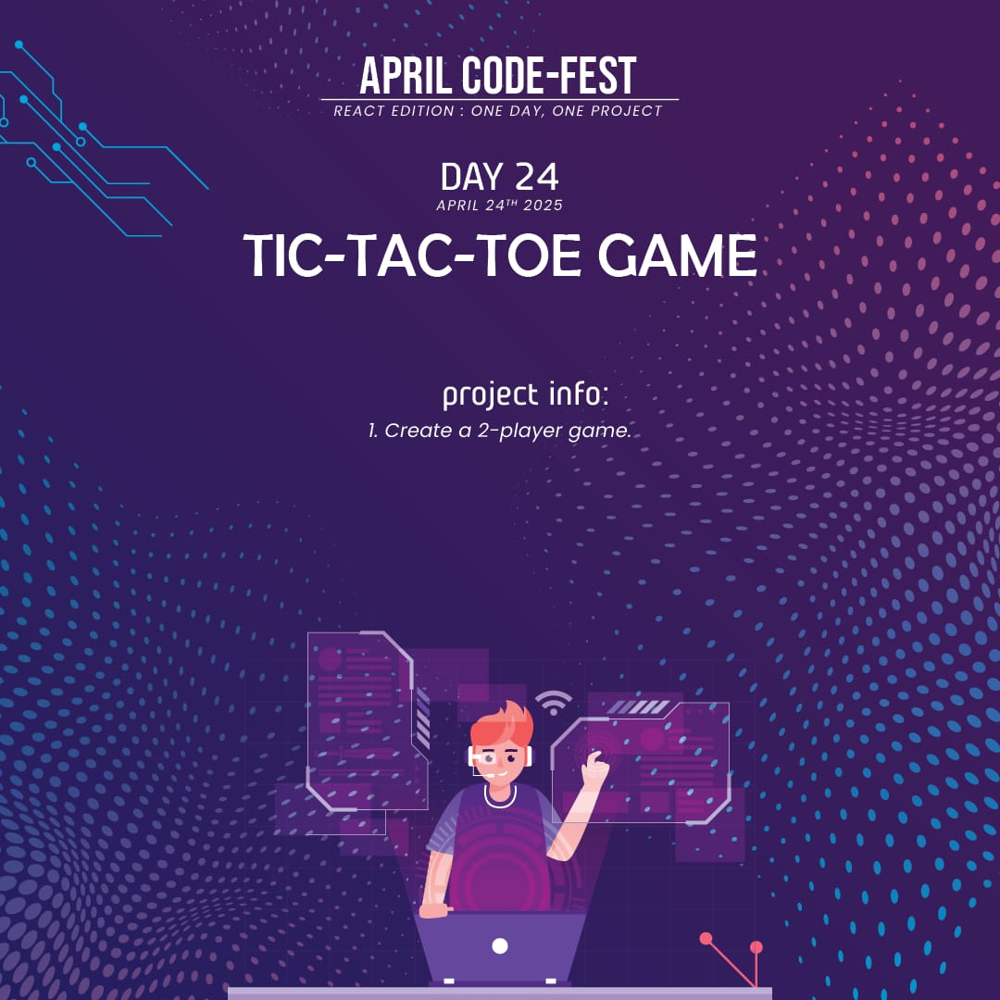
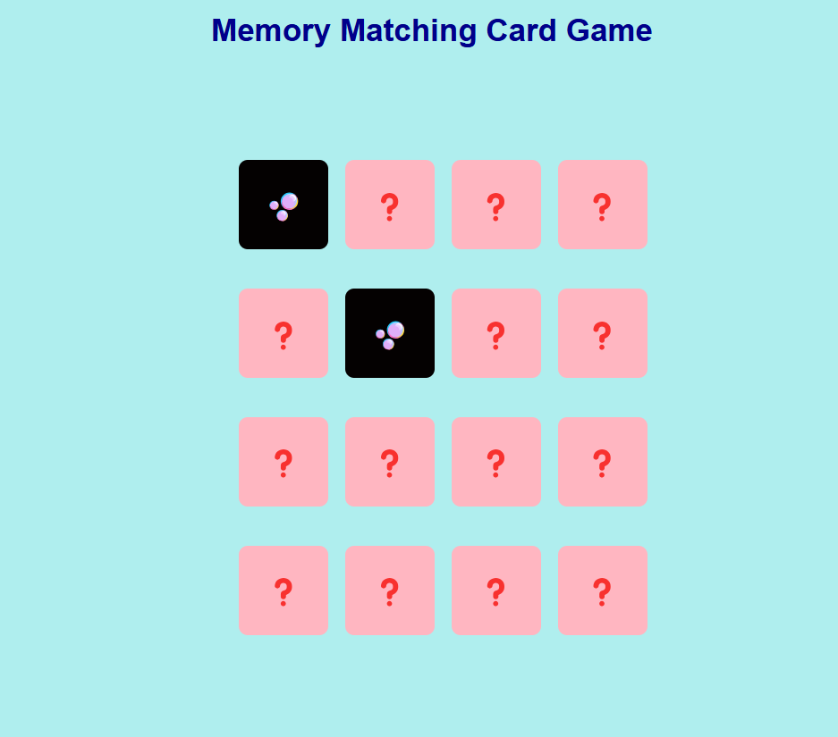

# ❌⭕ Tic Tac Toe Game

A simple yet beautifully styled **Tic Tac Toe** game built with React. Play as X or O, win the match, and restart anytime. Great for a quick challenge!

---

## 📌 Features
- ✅ **2-Player Mode**: Play locally against a friend.
- ✅ **Win Detection**: Automatically shows winner when game ends.
- ✅ **Reset Button**: Instantly restart the board.
- ✅ **Smooth UI**: Soft colors and hover effects for a clean look.
- ✅ **Fully Responsive**: Works great on desktops and tablets.

---

## 🛠️ Technologies Used
- ⚛️ **React** (`useState`)
- 🧠 **JavaScript** (Game logic in `tic.js`)
- 🎨 **CSS** (`tic.css` for colorful styling)


---

## 🚀 Live Demo
To see it in action, clone the repository and follow the setup instructions below.

1. **Clone the repository:**

   ```bash
   git clone 
   
   
2. **Navigate to the project directory:**

   cd  Tic-Tac-Toe-Game

3. **Install dependencies:**

   npm install

4. **Start the development server:**

   npm start

5. **Open your browser and visit:**

   http://localhost:3000

---

 ## 🎨 Screenshots:
 


 ---

 ## 🤝 Contributing:
 Want to improve this project? Fork the repository, create a feature branch, and open a pull request. All contributions are welcome! 🚀✨
 
 ---

 🎉 Happy Coding!